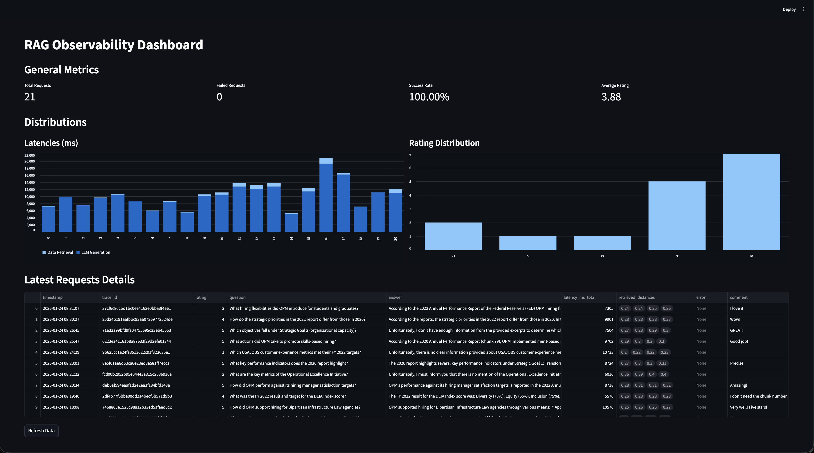

# RAG Observability

[](https://www.python.org/downloads/)
[](https://fastapi.tiangolo.com/)
[](https://streamlit.io/)
[](https://www.trychroma.com/)
[](https://opentelemetry.io/)
[](LICENSE)

This project is a local-first Retrieval-Augmented Generation (RAG) application that uses Federal Reserve reports as a knowledge base. It includes a FastAPI backend, a user-facing Streamlit application for interacting with the RAG system, and a developer-facing Streamlit dashboard for observing the performance and behavior of the RAG system.

## What is this?

Imagine you have a collection of documents (in this case, Federal Reserve reports) and you want to ask questions about them. This project provides a way to do that. It uses a technique called Retrieval-Augmented Generation (RAG) to find the most relevant information in the documents and then uses a large language model (LLM) to generate an answer.

The project also includes a dashboard that allows you to see how well the system is performing, including how long it takes to answer questions and how accurate the answers are.

## Components

This project is composed of three distinct services that work together:

1.  **FastAPI Backend**: This is the heart of the application. It exposes an API that handles the entire Retrieval-Augmented Generation (RAG) process, from embedding the user's question to querying the vector database and generating a final answer with the LLM.

2.  **User Frontend (Streamlit)**: This is the primary interface for the end-user. It provides a simple and intuitive chatbot application where a user can:
    *   Ask questions about the Federal Reserve reports.
    *   Receive the generated answers.
    *   Provide feedback on the quality of each answer through a rating (1-5 stars) and an optional text comment.

    <p align="center">
      
      <br/>
      <em>The chatbot interface showing question input, generated answers with retrieved sources, and the rating system.</em>
    </p>

3.  **Developer Dashboard (Streamlit)**: This is the control panel for developers and system operators. It provides a comprehensive view of the system's performance and behavior, allowing you to:
    *   Monitor key metrics like latency, request volume, and success rate.
    *   Inspect a detailed log of the latest requests, including the questions, answers, and retrieved document chunks.
    *   Analyze user feedback to identify areas for improvement.

    <p align="center">
      
      <br/>
      <em>The developer dashboard displaying key metrics, performance analytics, and detailed request logs with trace IDs for debugging.</em>
    </p>

## Core Observability Feature: Correlating Feedback and Traces

A key challenge in maintaining complex systems, especially those involving LLMs, is connecting a user's subjective experience (e.g., "the answer was slow" or "this information is incorrect") to the underlying technical events. This project demonstrates a powerful solution to this problem by correlating user feedback directly with distributed traces.

Here's how it works:

1.  **Trace ID Propagation**: Every request that comes into the system is assigned a unique `trace_id` that is propagated through all subsequent operations, from the initial API call to the database queries and the final LLM generation.
2.  **Feedback Collection**: When a user provides feedback (e.g., a rating or a comment) on a specific answer, that feedback is stored in the database alongside the `trace_id` of the original request.
3.  **Root Cause Analysis**: The observability dashboard displays the `trace_id` for each request. If a developer sees a request with a poor rating, they can immediately copy that `trace_id`.

With this `trace_id`, the developer can instantly find the complete, end-to-end technical trace for that specific request in the `traces.json` file (or a production tracing system like Jaeger). This allows them to see a detailed breakdown of all operations, including latencies, retrieved documents, and any errors, making it significantly easier to diagnose the root cause of the user's issue. This tight loop between user feedback and technical traces is fundamental for effective root cause analysis and continuous improvement.

## Getting Started

This guide will walk you through the entire process of setting up and running the project on your local machine.

### 1. Prerequisites

Before you begin, you will need to install a few things:

*   **Python**: This project requires Python 3.10 or higher. You can download it from the [official Python website](https://www.python.org/downloads/).
*   **uv**: This is a fast Python package manager that we use to install the project's dependencies. You can install it by opening a terminal and running the following command:

    ```bash
    pip install uv
    ```

*   **Ollama**: This is a tool that allows you to run large language models on your local machine. You can download it from the [Ollama website](https://ollama.ai/).

### 2. Installation and Setup

1.  **Clone the repository:**

    First, you need to get a copy of the project on your machine. You can do this by cloning the repository from GitHub. Open a terminal and run the following command:

    ```bash
    git clone https://github.com/your-username/rag-observability.git
    cd rag-observability
    ```

2.  **Create and activate the virtual environment:**

    It's a good practice to create a virtual environment for each Python project. This keeps the dependencies for each project separate. `uv` can create and manage this for you. Run the following command in your terminal:

    ```bash
    uv venv
    ```

    This will create a virtual environment in a `.venv` directory. To activate it, run:

    **On macOS and Linux:**
    ```bash
    source .venv/bin/activate
    ```

    **On Windows:**
    ```bash
    .venv\Scripts\activate
    ```

3.  **Install the dependencies:**

    Now that you have your virtual environment set up, you can install all of the project's dependencies with `uv`:

    ```bash
    uv sync
    ```

4.  **Set up Ollama:**

    After you have installed Ollama, you need to download the models that this project uses. Open a terminal and run the following commands:

    ```bash
    ollama pull nomic-embed-text
    ollama pull llama3.1
    ```

    This will download the `nomic-embed-text` model (used for creating embeddings) and the `llama3.1` model (used for generating answers).

5.  **Ingest the data and initialize the database:**

    The final setup step is to "ingest" the data. This process involves reading the PDF documents, splitting them into smaller chunks, creating embeddings (numerical representations) for each chunk, and storing them in a local vector database.

    This step also initializes the ChromaDB database, creating the `chroma_db` directory and the necessary files within it.

    Run the following command in your terminal:

    ```bash
    python -m app.rag.ingest
    ```

### 3. Running the Application

The project consists of three main components: a FastAPI backend, a user-facing Streamlit application, and a developer-facing Streamlit dashboard. You will need to run all of them in separate terminals.

1.  **Run the FastAPI Backend:**

    The FastAPI backend is the core of the application. It handles the RAG pipeline and provides an API for querying the system. The traces will be saved to a `traces.json` file in the project root.

    In your first terminal, run the following command:

    ```bash
    uvicorn app.main:app --reload
    ```

    The API will be available at `http://127.0.0.1:8000`.

2.  **Run the User Frontend:**

    The user frontend provides a simple chat interface for interacting with the RAG system.

    In your second terminal, run the following command:

    ```bash
    streamlit run frontend/app.py
    ```

    The user frontend will be available at `http://localhost:8501`.

3.  **Run the Developer Dashboard:**

    The developer dashboard provides a user interface for visualizing the performance of the RAG system.

    In your third terminal, run the following command:

    ```bash
    streamlit run dashboard/app.py --server.port 8502
    ```

    The developer dashboard will be available at `http://localhost:8502`.

## Testing

This project uses `pytest` for testing. A structural testing framework is in place to ensure the reliability and correctness of the code.

### 1. Install Dependencies

To run the tests, you first need to install the development dependencies:

```bash
uv pip install -e '.[dev]'
```

### 2. Run the Tests

Once the dependencies are installed, you can run the entire test suite with the following command:

```bash
pytest
```

The tests will run, and you should see a confirmation that they have passed. The current test suite includes a foundational test for the core RAG query pipeline, which demonstrates how to write tests by mocking external services.

### Production Considerations

For a production environment, it is recommended to use a more robust tracing setup. Here are some best practices:

*   **Use a Distributed Tracing System:** Instead of exporting traces to a JSON file, you should send them to a distributed tracing system like Jaeger, Zipkin, or Honeycomb. This will allow you to visualize traces in real-time, set up alerts, and get a better overview of your system's performance.
*   **Configure Sampling:** In a high-traffic production environment, you might not want to trace every single request. OpenTelemetry allows you to configure sampling to reduce the amount of data you collect.

The current implementation is for local development and demonstration purposes. It is not recommended to use the file exporter in a production environment.

## Project Structure

Here is a brief overview of the most important files and directories in the project:

```
.
├── app/
│   ├── main.py             # The FastAPI application
│   ├── config.py           # Pydantic settings for configuration
│   ├── observability/
│   │   ├── db.py           # Logic for interacting with the database
│   │   ├── logger.py       # Logic for logging requests
│   │   └── tracing.py      # OpenTelemetry tracer configuration
│   └── rag/
│       ├── ingest.py       # The script for ingesting data
│       └── query.py        # The logic for the RAG query pipeline
├── dashboard/
│   └── app.py              # The Streamlit dashboard application
├── frontend/
│   └── app.py              # The user-facing Streamlit application
├── data/
│   └── fed_reports/        # The PDF documents that are used as the knowledge base
├── pyproject.toml          # The project's metadata and dependencies
└── README.md               # This file
```

